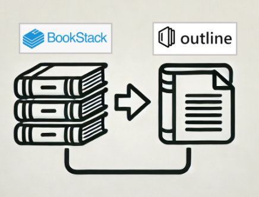
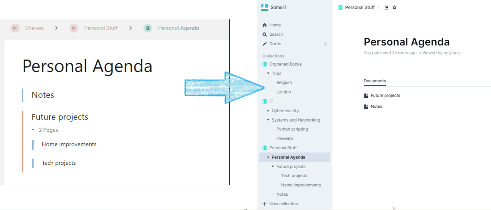
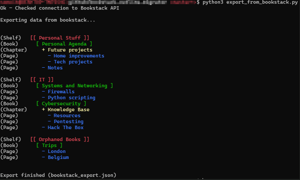

BookStack to Outline Migrator
=============================

This toolset facilitates the migration of content from [BookStack](https://www.bookstackapp.com/) to [Outline](https://github.com/outline/outline), a modern knowledge base. The tool includes two Python scripts:

1.  `export_from_bookstack.py`: Exports content from BookStack into a JSON file.
2.  `import_to_outline.py`: Imports the exported JSON file into Outline

Features
--------

*   Converts BookStack shelves to Outline collections.
*   Converts BookStack books, chapters, and pages to Outline documents.
*   Maintains document hierarchy during the migration.
*   Automatically downloads and saves images into the Outline storage during the import process.
*   Orphaned books (books not placed in a shelf) are imported under "Orphaned books" collection

Installation
------------

1.  Clone the repository:  
    `git clone https://github.com/somoit-net/bookstack_outline_migrator.git`

2.  cd to the newly created folder  
    `cd bookstack_outline_migrator`
    
3.  Install the necessary Python packages  
    `pip3 install -r requirements`

Configuration
-------------

A sample `config.txt` file is included in the repository. You need to update this file with your specific BookStack and Outline credentials and URLs.

    # Bookstack and Outline config
    
    # Bookstack
    BOOKSTACK_BASE_URL=https://bookstack.mydomain.com
    BOOKSTACK_API_TOKEN_ID=xxxxxxxxxxxxxxxxxxxxxxxxxxxxx
    BOOKSTACK_API_TOKEN_SECRET=xxxxxxxxxxxxxxxxxxxxxxxxxxxxxx
    BOOKSTACK_EXPORT_FILENAME=bookstack_export.json
    
    # Outline
    OUTLINE_BASE_URL=https://outline.mydomain.com
    OUTLINE_API_TOKEN=xxxxxxxxxxxxxxxxxxxxxxxxxxxxxx

*   **BOOKSTACK\_BASE\_URL**: URL of your BookStack instance.
*   **BOOKSTACK\_API\_TOKEN\_ID**: Your BookStack API token ID.
*   **BOOKSTACK\_API\_TOKEN\_SECRET**: Your BookStack API token secret.
*   **BOOKSTACK\_EXPORT\_FILENAME**: Name of the file where the exported data will be saved (default is `bookstack_export.json`).
*   **OUTLINE\_BASE\_URL**: URL of your Outline instance.
*   **OUTLINE\_API\_TOKEN**: Your Outline API token.

Usage
-----

### 1\. Export from BookStack

To export content from BookStack, run the following command:

    python3 export_from_bookstack.py

This will generate a JSON file named as specified in `BOOKSTACK_EXPORT_FILENAME`.

**Note:** Ensure that the BookStack site is accessible and the `config.txt` file is correctly configured.

### 2\. Import to Outline

To import the exported content into Outline, use the following command:

    python3 import_to_outline.py

The output is similar to the import process

**Note:** The Bookstack site must still be accessible so the script can automatically download the images.

**Note:** Do not forget to disable rate limiter. Otherwise Outline would return errors during import: `RATE_LIMITER_ENABLED=false`
